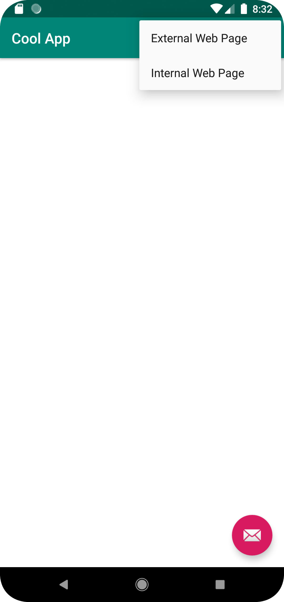

# Rapport

I denna uppgift har applikationen fått ett nytt namn tillsammans med att sin textruta nu har blivit en "webview". Webview:n har förmågan att visa upp två olika typer av hemsidor.
Dessa sidor ändras beroende på vilket val som skett i menyn. Antingen kan en extern hemsida visas (his.se) eller en intern hemsida (html-fil). För att den externa hemsidan ska vara möjlig att visas har även appen fått tillgång till internetuppkoppling.

```
<uses-permission android:name="android.permission.INTERNET" />
```
Internet har blivit tillgänglig med hjälp av koden ovan. Denna kodsnutt kan bli funnen i filen "AndroidManifest.xml".

```
<WebView
        android:id="@+id/web_view"
        android:layout_height="match_parent"
        android:layout_width="match_parent"
        />
```
Webview:n fick, som tidigare nämnt, en förändring gjord genom en variabel. Ändringarna påverkade två olika filer vid namn "content_main.xml" och "MainActivity.java".

```
import android.webkit.WebView;
```

```
WebView webView;
```

För att göra det möjligt att använda javascript kod gjordes även en ändring i filen "MainActivity.java". Koden kan hittas i kodblocket nedan:

```
webView.getSettings().setJavaScriptEnabled(true);
```




Bilderna visar valet man får i huvudmenyn av extern samt intern sida. Den andre bilden visar vad som händer om man väljer det externa alternativet.